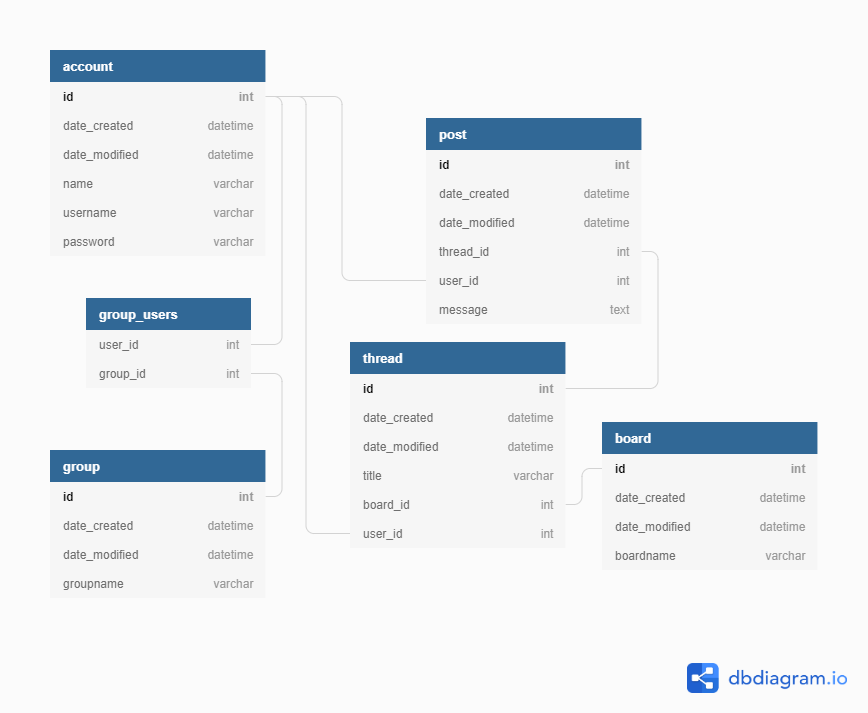

# Tietokantakaavio



## SQL-schema

```
CREATE TABLE board (
        id INTEGER NOT NULL,
        date_created DATETIME,
        date_modified DATETIME,
        boardname VARCHAR(64) NOT NULL,
        PRIMARY KEY (id)
);
CREATE TABLE account (
        id INTEGER NOT NULL,
        date_created DATETIME,
        date_modified DATETIME,
        name VARCHAR(144) NOT NULL,
        username VARCHAR(144) NOT NULL,
        password VARCHAR(144) NOT NULL,
        PRIMARY KEY (id)
);
CREATE TABLE thread (
        id INTEGER NOT NULL,
        date_created DATETIME,
        date_modified DATETIME,
        title VARCHAR(64) NOT NULL,
        user_id INTEGER NOT NULL,
        board_id INTEGER NOT NULL,
        PRIMARY KEY (id),
        FOREIGN KEY(user_id) REFERENCES account (id),
        FOREIGN KEY(board_id) REFERENCES board (id)
);
CREATE TABLE post (
        id INTEGER NOT NULL,
        date_created DATETIME,
        date_modified DATETIME,
        message TEXT NOT NULL,
        user_id INTEGER NOT NULL,
        thread_id INTEGER NOT NULL,
        PRIMARY KEY (id),
        FOREIGN KEY(user_id) REFERENCES account (id),
        FOREIGN KEY(thread_id) REFERENCES thread (id)
);
CREATE TABLE IF NOT EXISTS "group" (
        id INTEGER NOT NULL,
        date_created DATETIME,
        date_modified DATETIME,
        groupname VARCHAR(64) NOT NULL,
        PRIMARY KEY (id)
);
CREATE TABLE group_users (
        group_id INTEGER,
        user_id INTEGER,
        FOREIGN KEY(group_id) REFERENCES "group" (id),
        FOREIGN KEY(user_id) REFERENCES account (id)
);
```